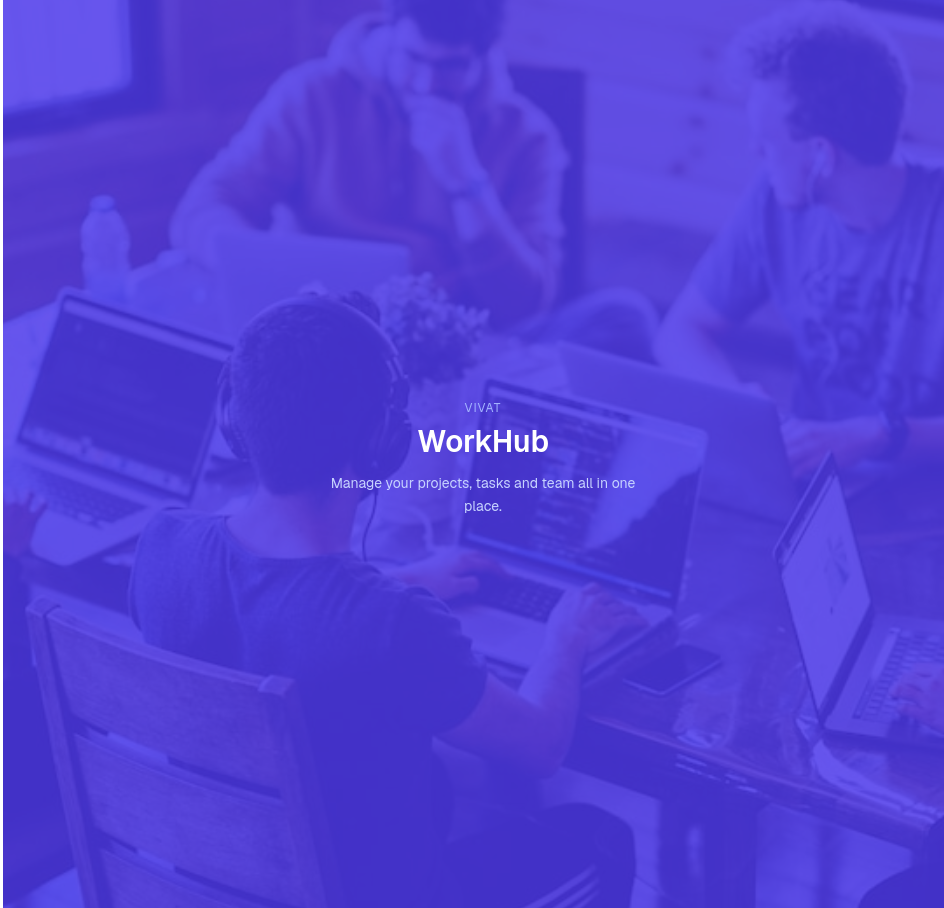

# 🚀 VIVAT WorkHub

**All-in-one project & task management platform** — projects, tasks, customers, kanban boards, Gantt charts, real-time notifications, audit logs and multi-language support.

---

## 📦 Monorepo Structure  + 📚 Documentation

This repository contains two independent apps:

| Folder | Description | Docs |
|---|---|---|
| 🖥️ [`/server`](./server) | REST API + Socket.IO backend — Express, PostgreSQL, Prisma | [📖 Server README](./server/README.md) |
|  | architecture, data model, full API reference, env vars, deployment notes |  |
| 💻 [`/client`](./client) | Web frontend — React, Vite, Tailwind, shadcn/ui | [📖 Client README](./client/README.md) |
|  | tech stack, routing, hooks, services, auth flow, i18n |  |

## ✨ Highlights

- 🔐 Auth — email/password + Google OAuth
- 📁 Projects — kanban board, Gantt-style tasks, files, discussions
- ✅ Tasks — drag & drop, assignees, priorities
- 🏢 Customers — individuals & companies
- 💬 Real-time comments & notifications
- 📊 Dashboard — stats, charts, activity heatmap
- 📝 Full audit trail of every action
- 🌍 i18n — 🇷🇴 🇬🇧 🇷🇺
- 👮 Admin panel — users, customers, projects, tasks, logs

Made with ☕ for **VIVAT WorkHub**

