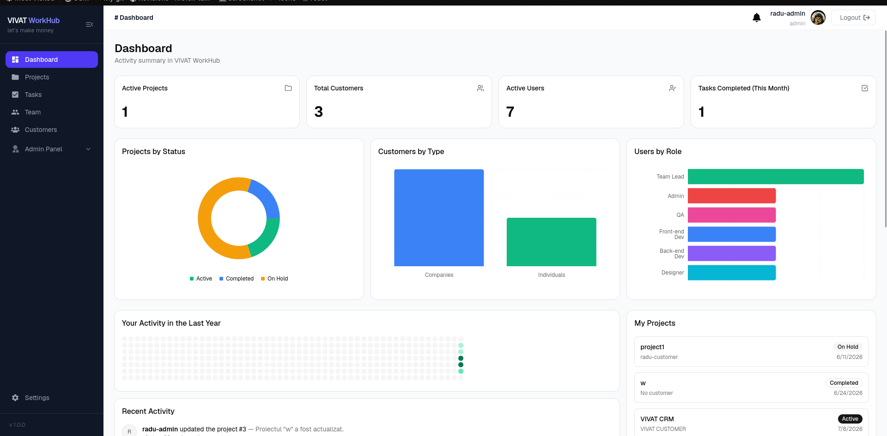
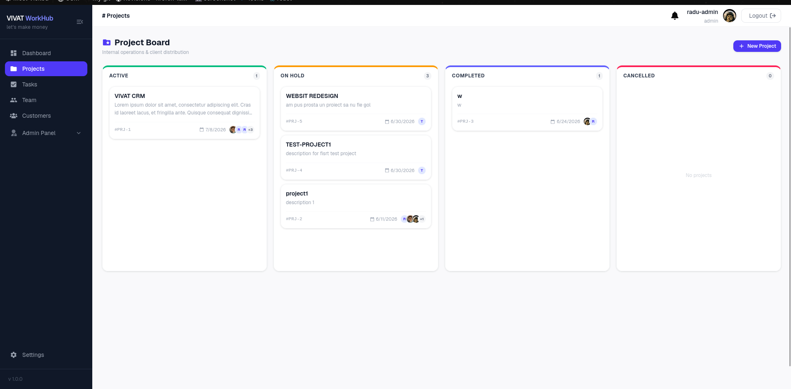
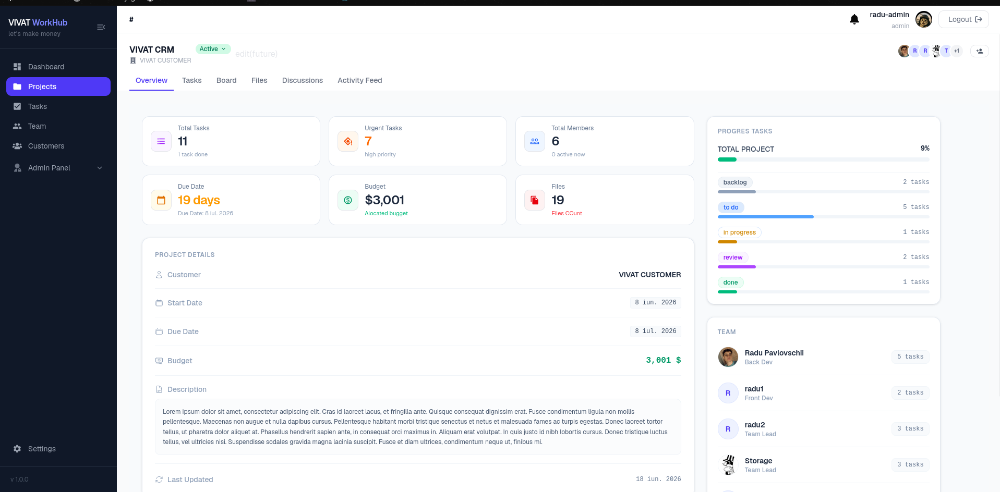
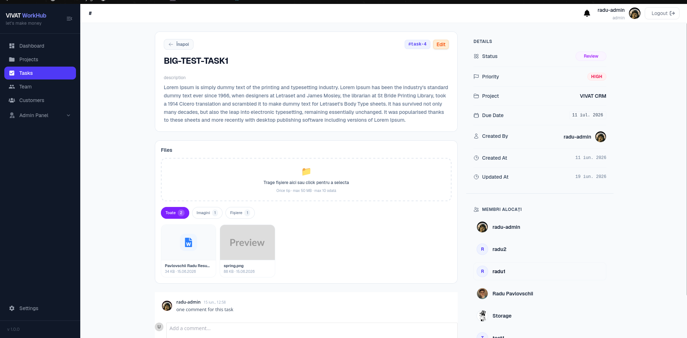
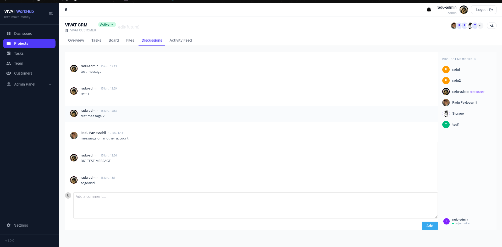
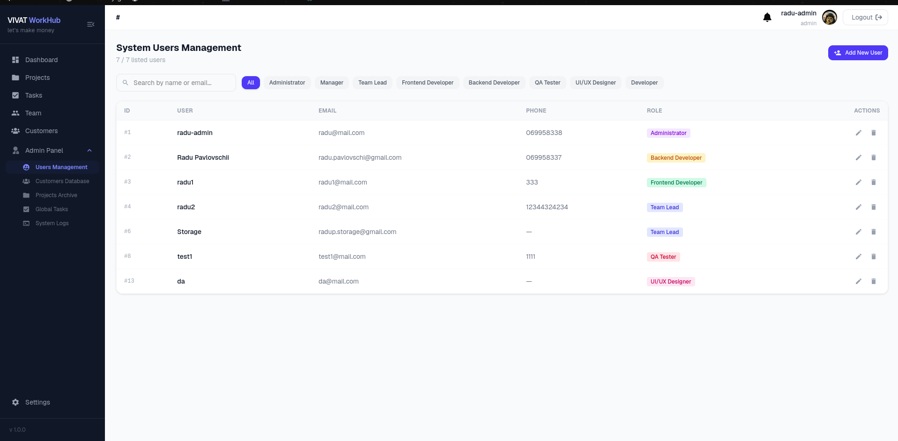
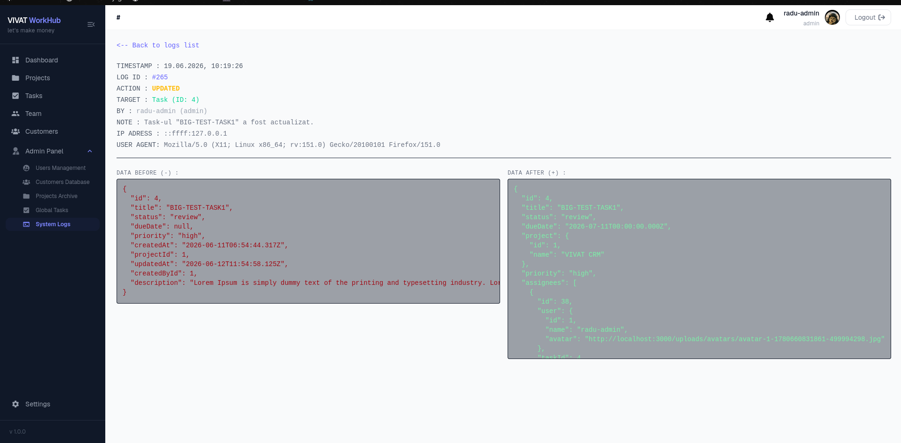
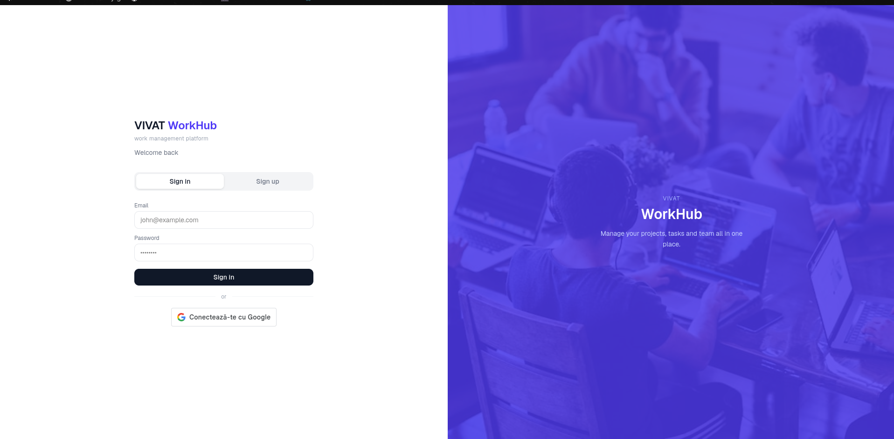

<div align="center">

# 💼 VIVAT WorkHub — Client

**Frontend** for VIVAT WorkHub — projects, tasks, customers, kanban boards, Gantt charts, real-time notifications & multi-language UI.


<!--
📸 SCREENSHOT: Dashboard overview (hero shot)
Put your best-looking screenshot here, ~1280x720, e.g.:

-->

</div>

---

## 📚 Table of Contents

- [💼 VIVAT WorkHub — Client](#-vivat-workhub--client)
  - [📚 Table of Contents](#-table-of-contents)
  - [✨ Features](#-features)
  - [📸 Screenshots](#-screenshots)
  - [🛠️ Tech Stack](#️-tech-stack)
  - [⚡ Quick Start](#-quick-start)
  - [🔑 Environment Variables](#-environment-variables)
  - [📜 Scripts](#-scripts)
  - [🧭 Routing](#-routing)
  - [🏗 Architecture \& Data Flow](#-architecture--data-flow)
  - [🔐 Authentication Flow](#-authentication-flow)
  - [🧠 State Management](#-state-management)
  - [🪝 Custom Hooks](#-custom-hooks)
  - [📡 API Services](#-api-services)
  - [🔔 Real-Time (Socket.IO)](#-real-time-socketio)
  - [🧩 Type System](#-type-system)
  - [🌍 Internationalization](#-internationalization)
  - [📂 Project Structure](#-project-structure)
  - [⚠️ Known Issues](#️-known-issues)

## ✨ Features

- 📊 Dashboard — stats, charts, activity heatmap, deadlines, recent comments/files
- 📁 Projects — overview, kanban board, Gantt-style tasks, files, discussions
- ✅ Tasks — drag & drop board, assignees, priorities, dedicated detail page
- 🏢 Customers — individuals & companies, linked projects
- 💬 Real-time comments (SVAR) & notifications (Socket.IO)
- 🔐 Auth — email/password + Google OAuth, persisted session
- 🌍 i18n — 🇷🇴 🇬🇧 🇷🇺
- 👮 Admin panel — users, customers, projects, tasks, audit logs

## 📸 Screenshots

> Add real screenshots here so the README sells the app at a glance — this is usually the single highest-impact section for a popular-looking repo.

| | |
|---|---|
| **Dashboard** <br> *(stats, charts, heatmap)* | <!--  --> |
| **Project Board** <br> *(kanban, drag & drop)* | <!--  --> |
| **Project Overview** <br> *(details, team, budget)* | <!--  --> |
| **Task Detail** <br> *(assignees, priority, comments)* | <!--  --> |
| **Discussions** <br> *(real-time comments)* | <!--  --> |
| **Admin — Users** <br> *(role management)* | <!--  --> |
| **Admin — Audit Logs** <br> *(before/after diff)* | <!--  --> |
| **Login** <br> *(email/password + Google)* | <!--  --> |

**Suggested setup:**
```
client/
└── docs/
    └── screenshots/
        ├── dashboard.png
        ├── project-board.png
        ├── project-overview.png
        ├── task-detail.png
        ├── discussions.png
        ├── admin-users.png
        ├── admin-logs.png
        └── auth.png
```
Uncomment the ``/`` lines above once the files exist. A consistent size (e.g. crop to 1280×800, light mode) makes the table look clean. A short screen-recording (GIF) for the kanban drag & drop is a nice bonus, since that's a feature static images undersell.

## 🛠️ Tech Stack

| | |
|---|---|
| **UI** | React 19 · Vite · TypeScript |
| **Styling** | Tailwind CSS 4 · shadcn/ui (style: `radix-nova`) · Radix UI · lucide-react |
| **Routing** | React Router 7 (nested routes, layout routes) |
| **State** | React Context (`AuthProvider`, `DashboardProvider`) + local component state |
| **Data fetching** | Axios (raw + `apiClient` wrapper) · custom hooks |
| **Real-time** | Socket.io-client |
| **Charts** | Recharts |
| **Drag & drop** | @hello-pangea/dnd (kanban boards) |
| **Gantt** | SVAR React Gantt |
| **Comments widget** | SVAR React Comments |
| **Notifications (toast)** | react-hot-toast |
| **i18n** | i18next + react-i18next |

## ⚡ Quick Start

```bash
git clone <repository-url>
cd VIVAT_WorkHub/client
npm install
cp .env.example .env     # fill in your values
npm run dev
```

➡️ App at `http://localhost:5173` · requires the [backend server](../server) running.

## 🔑 Environment Variables

| Variable | Required | Description |
|---|:---:|---|
| `VITE_API_URL` | ✅ | Backend REST base URL, e.g. `http://localhost:3000/api` |
| `VITE_GOOGLE_CLIENT_ID` | ⚠️ | Google OAuth Client ID — required only for Google Sign-In |
| `PACKAGE_VERSION` | ❌ | App version string shown in UI |

## 📜 Scripts

| Command | Description |
|---|---|
| `npm run dev` | Start Vite dev server |
| `npm run build` | `tsc -b` type-check + production build |
| `npm run preview` | Preview the production build locally |
| `npm run lint` | Run ESLint |

## 🧭 Routing

Defined in [`src/routes/AppRouter.tsx`](./src/routes/AppRouter.tsx) using React Router 7. `/auth` is public-only (`PublicRoute` redirects logged-in users to `/dashboard`); everything else nests inside `PrivateRoute` + `MainLayout` (redirects to `/auth` if not logged in).

| Path | Page | Notes |
|---|---|---|
| `/` | → redirects to `/dashboard` | |
| `/auth` | `AuthPage` | login / register / Google |
| `/dashboard` | `DashboardPage` | |
| `/profile/:id` | `ProfilePage` | |
| `/projects` | `ProjectPage` | list |
| `/projects/add` | `AddProjectPage` | |
| `/projects/:id` | `ProjectDetailPage` | layout for nested tabs below |
| `/projects/:id/overview` | `ProjectDetailOverview` | default tab |
| `/projects/:id/tasks` | `ProjectTasksPage` | |
| `/projects/:id/board` | `ProjectBoardPage` | kanban |
| `/projects/:id/files` | `ProjectFilesPage` | |
| `/projects/:id/discussions` | `ProjectDiscussionPage` | |
| `/tasks` | `TasksPage` | list |
| `/tasks/:id` | `TaskDetailedPage` | |
| `/team` | `TeamPage` | |
| `/customers` | `CustomerPage` | |
| `/customers/:id` | `CustomerPage` | |
| `/settings` | `SettingsPage` | |
| `/admin` | `AdminDashboardPage` | |
| `/admin/users` | `AdminUsersPage` | |
| `/admin/customers` | `AdminCustomersPage` | |
| `/admin/projects` | `AdminProjectsPage` | |
| `/admin/tasks` | `AdminTasksPage` | |
| `/admin/logs` | `LogsPage` | |
| `/admin/logs/:id` | `LogDetailsPage` | |
| `*` | `NotFoundPage` | |

## 🏗 Architecture & Data Flow

```
Component → Hook (useX) → Service (X.service.ts) → axios / apiClient → Backend REST API
                │
                └── Socket.io-client ←── live push (notifications) ──→ Backend Socket.IO
```

- **`services/*.service.ts`** — one file per backend resource (`auth`, `user`, `project`, `task`, `customer`, `comments`, `attachments`, `members`, `notification`, `dashboard`, `admin`). Each function maps 1:1 to a backend endpoint and attaches the JWT manually via `Authorization: Bearer <token>`.
- **`services/client.ts`** — a parallel axios instance (`apiClient`) used by `dashboard.service.ts`, with a request interceptor that auto-attaches the token and a response interceptor that unwraps `response.data` and normalizes errors. (Most other services still build headers manually per-call — see [Known Issues](#️-known-issues).)
- **`hooks/*`** — thin wrappers that call services, hold loading/error state, and expose data + actions to components.
- **`context/*`** — app-wide state: current user (`AuthProvider`) and dashboard data (`DashboardProvider`, built on `useDashboardInternal`).

## 🔐 Authentication Flow

1. User submits credentials on `/auth` → `auth.service.ts` (`loginService` / `registerService` / `googleLoginService`) hits `/api/auth/login|register|google`.
2. On success, the JWT is stored in `localStorage` as `app_token`, and the user object is stored as `workhub_user`.
3. `AuthProvider.login()` connects the Socket.IO client (`socket.auth = { userId }; socket.connect()`).
4. On every subsequent request, the token is attached manually per-service (`Authorization: Bearer <app_token>`).
5. On page refresh, `AuthProvider` re-hydrates `user` from `localStorage` and reconnects the socket.
6. `AuthProvider.logout()` clears both `localStorage` keys and disconnects the socket.

```ts
// context/AuthProvider.tsx
const login = (userData: UserData) => {
  setUser(userData);
  localStorage.setItem('workhub_user', JSON.stringify(userData));
  socket.auth = { userId: userData.id };
  socket.connect();
};
```

`PrivateRoute` / `PublicRoute` in `AppRouter.tsx` gate access based on `useAuth().user` being set.

## 🧠 State Management

| Context | Hook | Provides |
|---|---|---|
| `AuthContext` | `useAuth()` | `user`, `isLoading`, `login()`, `logout()`, `updateUser()` |
| `DashboardContext` | `useDashboard()` | `stats`, breakdowns, `projects`, `activities`, `activityHeatmap`, `comments`, `files`, `isLoading`, `error`, `refresh()` |

No external state library (Redux/Zustand) — everything is Context + local `useState`/hooks.

## 🪝 Custom Hooks

| Hook | Purpose |
|---|---|
| `useApiQuery<T>(fetcher)` | Generic `{ data, isLoading, error, refetch }` wrapper around any async fetcher |
| `useAuth()` | Access `AuthContext` (throws if used outside `AuthProvider`) |
| `useDashboard()` | Access `DashboardContext` |
| `useDashboardInternal()` | Fetches all dashboard data in parallel (`Promise.all`) — powers `DashboardProvider` |
| `useAttachments(entityType, entityId)` | List/upload/delete attachments, with optimistic delete + rollback on failure |
| `useNotifications()` | Fetches notifications, subscribes to the `notification` socket event, shows a toast, exposes `markAsRead` / `markAllAsRead` |
| `useProjectMembers(projectId)` | Loads a project's team; also exports `getAvatarBg(name)` / `getInitials(name)` helpers |
| `useFileUrl(url)` | Fetches a protected file as a blob (with `Authorization` header) and returns an `object URL`, since `` can't send headers |

## 📡 API Services

Every function maps directly to a backend endpoint (see the [server README](../server/README.md#-api-reference) for full backend behavior).

<details>
<summary><strong>auth.service.ts</strong></summary>

| Function | Endpoint |
|---|---|
| `loginService(email, password)` | `POST /auth/login` |
| `registerService(name, email, password)` | `POST /auth/register` |
| `googleLoginService(idToken)` | `POST /auth/google` |
</details>

<details>
<summary><strong>user.service.ts</strong></summary>

| Function | Endpoint |
|---|---|
| `getUsersService()` | `GET /users` |
| `getUserByIdService(id)` | `GET /users/:id` |
| `createUserService(data)` | `POST /users` |
| `updateUserService(id, data)` | `PATCH /users/:id` |
| `updateRoleService(id, role)` | `PATCH /users/:id` |
| `deleteUserService(id)` | `DELETE /users/:id` |
| `updateProfileService(formData)` | `PATCH /users/profile/update` (multipart) |
</details>

<details>
<summary><strong>project.service.ts</strong></summary>

| Function | Endpoint |
|---|---|
| `getAllProjects()` | `GET /projects` |
| `getProjectById(id)` | `GET /projects/:id` |
| `createProject(data)` | `POST /projects` |
| `updateProject(id, data)` | `PATCH /projects/:id` |
| `deleteProject(id)` | `DELETE /projects/:id` |
</details>

<details>
<summary><strong>task.service.ts</strong></summary>

| Function | Endpoint |
|---|---|
| `getAllTasks()` | `GET /tasks` |
| `getProjectTasks(projectId)` | `GET /projects/:id/tasks` |
| `getTaskById(id)` | `GET /tasks/:id` |
| `createTask(data)` | `POST /tasks` |
| `updateTask(id, data)` | `PATCH /tasks/:id` |
| `deleteTask(id)` | `DELETE /tasks/:id` |
| `getTaskAssignees(taskId)` | `GET /tasks/:id/assignees` |
| `addTaskAssignee(taskId, userId)` | `POST /tasks/:id/assignees` |
| `removeTaskAssignee(taskId, userId)` | `DELETE /tasks/:id/assignees/:userId` |
</details>

<details>
<summary><strong>customer.service.ts</strong></summary>

| Function | Endpoint |
|---|---|
| `getAllCustomers()` | `GET /customers` |
| `getCustomerById(id)` | `GET /customers/:id` |
| `createCustomer(data)` | `POST /customers` |
| `updateCustomer(id, data)` | `PATCH /customers/:id` |
| `deleteCustomer(id)` | `DELETE /customers/:id` |
</details>

<details>
<summary><strong>members.service.ts</strong></summary>

| Function | Endpoint |
|---|---|
| `getProjectMembers(projectId)` | `GET /projects/:id/members` |
| `addProjectMember(projectId, data)` | `POST /projects/:id/members` |
| `updateProjectMember(projectId, memberId, data)` | `PATCH /projects/:id/members/:memberId`* |
| `removeProjectMember(projectId, memberId)` | `DELETE /projects/:id/members/:memberId` |
| `getTaskAssignees(taskId)` | `GET /tasks/:id/assignees` |
| `addTaskAssignee(taskId, data)` | `POST /tasks/:id/assignees` |
| `removeTaskAssignee(taskId, assigneeId)` | `DELETE /tasks/:id/assignees/:assigneeId` |

\* *Not currently implemented on the backend — see [Known Issues](#️-known-issues).*
</details>

<details>
<summary><strong>comments.service.ts</strong></summary>

| Function | Endpoint |
|---|---|
| `fetchComments(entityType, entityId)` | `GET /comments/:entityType/:entityId` |
| `createComment(entityType, entityId, content)` | `POST /comments/:entityType/:entityId` |
| `updateComment(commentId, content)` | `PUT /comments/:commentId` |
| `deleteComment(commentId)` | `DELETE /comments/:commentId` |

Maps backend `CommentResponse` → SVAR widget's expected `SvarComment` shape via `toSvarComment()`.
</details>

<details>
<summary><strong>attachments.service.ts</strong></summary>

| Function | Endpoint |
|---|---|
| `fetchAttachments(entityType, entityId)` | `GET /attachments/:entityType/:entityId` |
| `uploadAttachments(entityType, entityId, files)` | `POST /attachments/:entityType/:entityId` (multipart, `files` field) |
| `deleteAttachment(id)` | `DELETE /attachments/:id` |
</details>

<details>
<summary><strong>notification.service.ts</strong></summary>

| Function | Endpoint |
|---|---|
| `getNotifications()` | `GET /notifications` |
| `markNotificationAsRead(id)` | `PATCH /notifications/:id/read` |
| `markAllNotificationsAsRead()` | `PATCH /notifications/read-all` |
</details>

<details>
<summary><strong>dashboard.service.ts</strong> (uses <code>apiClient</code>)</summary>

| Function | Endpoint |
|---|---|
| `getDashboardStats()` | `GET /dashboard/stats` |
| `getProjectStatusBreakdown()` | `GET /dashboard/charts/project-status` |
| `getCustomerTypeBreakdown()` | `GET /dashboard/charts/customer-type` |
| `getUserRoleBreakdown()` | `GET /dashboard/charts/user-roles` |
| `getRecentActivity(limit?)` | `GET /dashboard/activity` |
| `getActivityHeatmap()` | `GET /dashboard/activity-heatmap` |
| `getMyProjects()` | `GET /dashboard/my-projects` |
| `getUpcomingDeadlines(days?)` | `GET /dashboard/upcoming-deadlines` |
| `getRecentComments(limit?)` | `GET /dashboard/recent-comments` |
| `getRecentFiles(limit?)` | `GET /dashboard/recent-files` |
</details>

<details>
<summary><strong>admin.service.ts</strong></summary>

CRUD for users, customers, projects, tasks (`adminGetX` / `adminCreateX` / `adminUpdateX` / `adminDeleteX`) plus `adminGetAllLogs()` / `adminGetLogByIdLog(id)` — used by the `/admin/*` pages. Functionally overlaps with `user.service.ts`, `customer.service.ts`, `project.service.ts`, `task.service.ts` (see [Known Issues](#️-known-issues)).
</details>

## 🔔 Real-Time (Socket.IO)

```ts
// lib/socket.ts — connects manually after login (see AuthProvider)
socket.auth = { userId };
socket.connect();
```

```ts
// useNotifications.ts
socket.on('notification', (notification) => {
  setNotifications(prev => [notification, ...prev]);
  toast(notification.message, { icon: '🔔' });
});
```

Backend emits `notification` events into a per-user Socket.IO room when a user is added/removed from a project or assigned/unassigned a task — see [server docs](../server/README.md#-real-time-events).

## 🧩 Type System

Key shared types live in `src/types/`:

| File | Exports |
|---|---|
| `auth.types.ts` | `UserData`, `AuthContextType` |
| `project.types.ts` | `Project`, `ProjectMember`, `ProjectMemberWithUser`, `ProjectStatus` |
| `task.types.ts` | `Task`, `TaskAssignee`, `TaskStatus`, `TaskPriority` |
| `customer.type.ts` | `Customer`, `CustomerProject`, `CustomerType` |
| `admin.types.ts` | `CustomerData`, `ProjectData`, `TaskData` (admin CRUD payload shapes) |
| `comments.types.ts` | `SvarComment`, `SvarOnChange`, `CommentResponse`, `CommentEntityType` |
| `attachment.types.ts` | `AttachmentResponse`, `AttachmentEntityType` |
| `notification.types.ts` | `Notification` |
| `dashboard.types.ts` | `DashboardStats`, `StatusCount<T>`, `ActivityLogEntry`, `ActivityHeatmapDay`, `DashboardProject`, `DashboardComment`, `DashboardAttachment` |
| `logs.types.ts` | `ActivityLog`, `DetailedActivityLog`, `GetLogsResponse`, `DetailedLogResponse` |
| `members.type.ts` | `ProjectMember`, `TaskAssignee` *(also re-exports service functions — see Known Issues)* |

Enums shared with the backend: `ProjectStatus` (`active`/`on_hold`/`completed`/`cancelled`), `TaskStatus` (`backlog`/`todo`/`in_progress`/`review`/`done`), `TaskPriority` (`low`/`medium`/`high`/`urgent`), `UserRole` (`admin`/`manager`/`team_lead`/`front_dev`/`back_dev`/`qa`/`designer`/`member`), `LogAction`.

## 🌍 Internationalization

Powered by `i18next` + `react-i18next`, configured in `src/i18n.ts`. Translation files live under `src/locales/` for **ro**, **en**, **ru**.

**Adding a new language:**
1. Create `src/locales/<lang>/translation.json` (copy `en` as a base).
2. Translate all keys.
3. Register the resource in `src/i18n.ts`.
4. Add the language option to the language switcher component.

## 📂 Project Structure

```
src/
├── components/          # feature components (projects/, tasks/, dashboard/, utils/, ui/...)
├── pages/                 # route-level views
│   ├── admin/              # AdminDashboard, AdminUsers, AdminCustomers, AdminProjects, AdminTasks, Logs
│   ├── projects/            # ProjectPage, ProjectDetailPage + tabs, AddProjectPage
│   └── tasks/                # TasksPage, TaskDetailedPage
├── routes/
│   └── AppRouter.tsx          # all route definitions (see Routing)
├── layouts/
│   └── MainLayout.tsx          # shell for authenticated pages
├── context/
│   ├── AuthProvider.tsx          # session + socket connection lifecycle
│   ├── DashboardProvider.tsx      # wraps useDashboardInternal
│   └── createContex.ts             # AuthContext / DashboardContext definitions
├── hooks/                            # see Custom Hooks
├── services/                          # see API Services — one file per resource
├── types/                              # see Type System
├── lib/
│   ├── client.ts (apiClient) / socket.ts  # axios instance + Socket.IO client
│   └── utils.ts
└── locales/
    ├── ro/translation.json
    ├── en/translation.json
    └── ru/translation.json
```

## ⚠️ Known Issues

- [ ] **Inconsistent auth header handling** — most services build `Authorization` headers manually per call; only `dashboard.service.ts` goes through the centralized `apiClient` interceptor in `client.ts`. Worth consolidating all services onto `apiClient`.
- [ ] **Socket URL hardcoded** in `src/lib/socket.ts` — should derive from `VITE_API_URL` instead of a fixed host.
- [ ] **Duplicate logic across `admin.service.ts` / `user.service.ts` / `customer.service.ts` / `project.service.ts` / `task.service.ts`** — admin pages re-implement CRUD already covered by the resource-specific services.
- [ ] **`members.type.ts` mixes types and service functions** — it both defines `ProjectMember`/`TaskAssignee` types *and* duplicates the axios calls already in `members.service.ts`. Should be split or de-duplicated.
- [ ] **`updateProjectMember`** in `members.service.ts` calls `PATCH /projects/:id/members/:memberId`, which doesn't currently exist on the backend (only add/list/remove are implemented there).
- [ ] **Token/user stored in plain `localStorage`** (`app_token`, `workhub_user`) — no refresh-token rotation or expiry handling client-side; relies on the JWT's own 2-day expiry from the backend.
- [ ] **`useFileUrl`** re-fetches the blob on every render where `url` changes identity — fine for stable URLs, but worth memoizing the URL upstream if it's reconstructed inline.

---

<div align="center">

Made with ☕ for **VIVAT WorkHub**

</div>