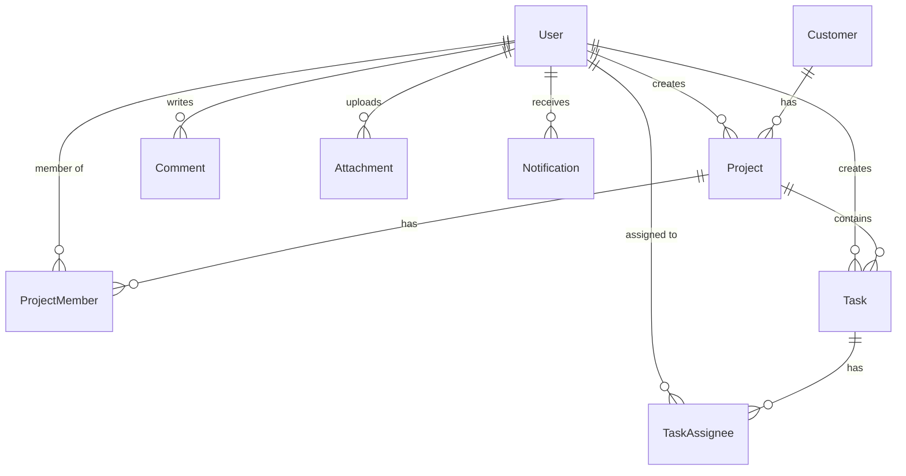

<div align="center">

# 🚀 VIVAT WorkHub — Server

**Project & task management API** — auth, projects, tasks, customers, comments, attachments, real-time notifications & audit logs.


</div>

---

## 📚 Table of Contents

- [Features](#-features)
- [Tech Stack](#️-tech-stack)
- [Architecture](#-architecture)
- [Data Model](#-data-model)
- [Quick Start](#-quick-start)
- [Environment Variables](#-environment-variables)
- [API Reference](#-api-reference)
- [Real-Time Events](#-real-time-events)
- [File Uploads](#-file-uploads)
- [Project Structure](#-project-structure)
- [Known Issues / TODO](#-known-issues--todo)

## ✨ Features

- 🔐 Auth — email/password + Google OAuth, JWT sessions
- 📁 Projects, tasks, customers — full CRUD + team/assignee management
- 💬 Comments — polymorphic, on projects or tasks
- 📎 Attachments — multi-file upload, 50MB/file
- 🔔 Real-time notifications via Socket.IO
- 📊 Dashboard — stats, breakdowns, activity heatmap
- 📝 Full audit trail — every write logged with before/after diff
- 👮 Role-based access — 8 roles, admin-gated routes

## 🛠️ Tech Stack

| | |
|---|---|
| **Runtime** | Node.js · TypeScript |
| **Framework** | Express 5 |
| **Database** | PostgreSQL via Prisma ORM |
| **Real-time** | Socket.IO |
| **Auth** | JWT · bcrypt · Google OAuth |
| **Uploads** | Multer |
| **Logging** | Morgan · custom audit log |

## 🏗 Architecture

```
Request → Route → Middleware (auth/upload) → Controller → Prisma → Response
                                                   ├── logActivity() ──→ ActivityLog
                                                   └── createNotification() ──→ Notification + Socket.IO push
```

📁 `routes/` → wiring only · 🛡️ `middleware/` → JWT + role checks · 🎮 `controllers/` → business logic · 🔧 `services/` → shared logic (notifications) · 🧰 `utils/` → audit logger

## 🗃 Data Model



| Model | Key fields |
|---|---|
| 👤 **User** | `role` (admin/manager/team_lead/front_dev/back_dev/qa/designer/member), `password` or `googleId` |
| 🏢 **Customer** | `type` (individual / company) + type-specific fields |
| 📁 **Project** | `status` (active/on_hold/completed/cancelled), `budget`, `dueDate` |
| ✅ **Task** | `status` (backlog/todo/in_progress/review/done), `priority` (low/medium/high/urgent) |
| 💬 **Comment** | polymorphic → `project` \| `task` |
| 📎 **Attachment** | polymorphic → `project` \| `task` |
| 📝 **ActivityLog** | `action`, `before`/`after` JSON diff, IP, user agent |
| 🔔 **Notification** | `type`, `read` flag |

Full schema → [`prisma/schema.prisma`](./prisma/schema.prisma)

## ⚡ Quick Start

```bash
git clone <repository-url>
cd VIVAT_WorkHub/server
npm install
cp .env.example .env        # fill in your values
npx prisma migrate dev
npm run dev
```

➡️ API at `http://localhost:3000` · Health check at `GET /h`

## 🔑 Environment Variables

| Variable | Required | Description |
|---|:---:|---|
| `PORT` | ❌ | Defaults to `3000` |
| `DATABASE_URL` | ✅ | PostgreSQL connection string |
| `JWT_SECRET` | ✅ | Secret for signing JWTs |
| `GOOGLE_CLIENT_ID` | ⚠️ | Required only for Google Sign-In |

## 📡 API Reference

🔓 = public · 🔒 = authenticated · 👮 = admin only

### Auth `/api/auth` 🔓
| Method | Endpoint | Description |
|---|---|---|
| `POST` | `/register` | Email/password sign-up |
| `POST` | `/login` | Email/password sign-in |
| `POST` | `/google` | Google ID token sign-in/up |

### Users `/api/users`
| Method | Endpoint | Access | Description |
|---|---|:---:|---|
| `GET` | `/` | 🔒 | List users |
| `GET` | `/:id` | 🔒 | Get user |
| `POST` | `/` | 👮 | Create user |
| `PATCH` | `/:id` | 👮 | Update user / role |
| `DELETE` | `/:id` | 👮 | Delete user |
| `PATCH` | `/profile/update` | 🔒 | Update own profile + avatar |

### Customers `/api/customers`
| Method | Endpoint | Description |
|---|---|---|
| `GET` | `/` | List customers |
| `GET` | `/:id` | Get customer |
| `POST` | `/` | Create customer |
| `PATCH` | `/:id` | Update customer |
| `DELETE` | `/:id` | Delete customer |

### Projects `/api/projects` 🔒
| Method | Endpoint | Description |
|---|---|---|
| `GET` | `/` | List projects |
| `GET` | `/:id` | Project detail + file count |
| `POST` | `/` | Create project |
| `PATCH` | `/:id` | Update project |
| `DELETE` | `/:id` | Delete project |
| `GET` | `/:id/members` | List team |
| `POST` | `/:id/members` | Add member → 🔔 notifies |
| `DELETE` | `/:id/members/:userId` | Remove member → 🔔 notifies |
| `GET` | `/:id/tasks` | List project tasks |

### Tasks `/api/tasks` 🔒
| Method | Endpoint | Description |
|---|---|---|
| `GET` | `/` | List tasks |
| `GET` | `/:id` | Task detail |
| `POST` | `/` | Create task |
| `PATCH` | `/:id` | Update task |
| `DELETE` | `/:id` | Delete task |
| `GET` | `/:id/assignees` | List assignees |
| `POST` | `/:id/assignees` | Assign user → 🔔 notifies |
| `DELETE` | `/:id/assignees/:userId` | Unassign user → 🔔 notifies |

### Comments `/api/comments` 🔒
| Method | Endpoint | Description |
|---|---|---|
| `GET` | `/:entityType/:entityId` | List comments |
| `POST` | `/:entityType/:entityId` | Create comment |
| `PUT` | `/:commentId` | Edit own comment |
| `DELETE` | `/:commentId` | Delete own comment |

### Attachments `/api/attachments` 🔒
| Method | Endpoint | Description |
|---|---|---|
| `POST` | `/:entityType/:entityId` | Upload files (max 10, 50MB each) |
| `GET` | `/:entityType/:entityId` | List attachments |
| `DELETE` | `/:id` | Delete (owner / admin / manager) |

### Notifications `/api/notifications` 🔒
| Method | Endpoint | Description |
|---|---|---|
| `GET` | `/` | Last 50 notifications |
| `PATCH` | `/read-all` | Mark all read |
| `PATCH` | `/:id/read` | Mark one read |

### Dashboard `/api/dashboard` 🔒
| Method | Endpoint | Description |
|---|---|---|
| `GET` | `/stats` | Overview counters |
| `GET` | `/charts/project-status` | Breakdown by status |
| `GET` | `/charts/customer-type` | Breakdown by type |
| `GET` | `/charts/user-roles` | Breakdown by role |
| `GET` | `/activity` | Recent activity feed |
| `GET` | `/activity-heatmap` | Yearly activity heatmap |
| `GET` | `/my-projects` | My projects |
| `GET` | `/upcoming-deadlines` | Deadlines in next N days |
| `GET` | `/recent-comments` | Recent comments on my projects |
| `GET` | `/recent-files` | Recent files on my projects |

### Logs `/api/logs` 👮
| Method | Endpoint | Description |
|---|---|---|
| `GET` | `/` | Last 50 audit log entries |
| `GET` | `/:id` | Single log entry |

## 🔔 Real-Time Events

```js
// client
const socket = io(SERVER_URL, { auth: { userId } });
socket.on('notification', (data) => { /* ... */ });
```

Triggered on: member added/removed from project, task assigned/unassigned.

## 📎 File Uploads

| Type | Field | Path | Limit | Types |
|---|---|---|---|---|
| 🖼 Avatar | `avatar` | `uploads/avatars/` | 4MB | jpg, png, webp |
| 📄 Attachment | `files[]` | `uploads/attachments/` | 50MB/file | any |

## 📂 Project Structure

```
server/
├── prisma/                # schema + migrations
├── src/
│   ├── app.ts              # bootstrap, middleware, Socket.IO
│   ├── config/prisma.ts    # Prisma client + query logging
│   ├── controllers/        # business logic
│   ├── middleware/         # auth + upload
│   ├── routes/              # endpoint wiring
│   ├── services/            # notification service
│   └── utils/logger.ts     # audit logger
├── uploads/                # avatars & attachments (gitignored)
└── logs/                   # prisma query logs (gitignored)
```

## ⚠️ Known Issues / TODO

- [ ] CORS origin hardcoded to `localhost:5173` in `app.ts`
- [ ] `authMiddleware` disabled on customer routes
- [ ] `getCustomerByIdHandler` reads `id` from body instead of params
- [ ] No production `build`/`start` script
- [ ] Avatar URL hardcoded to `localhost:3000`

---

<div align="center">

Made with ☕ for **VIVAT WorkHub**

</div>
